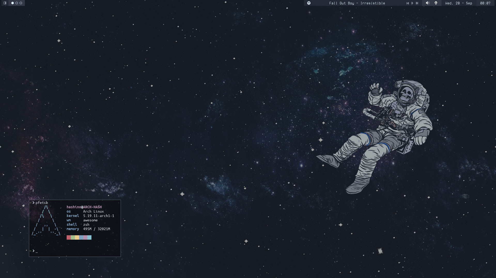
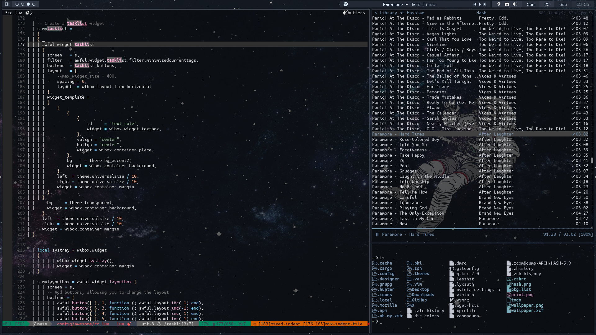
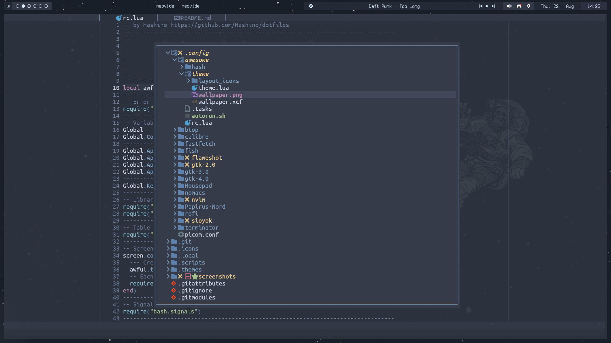
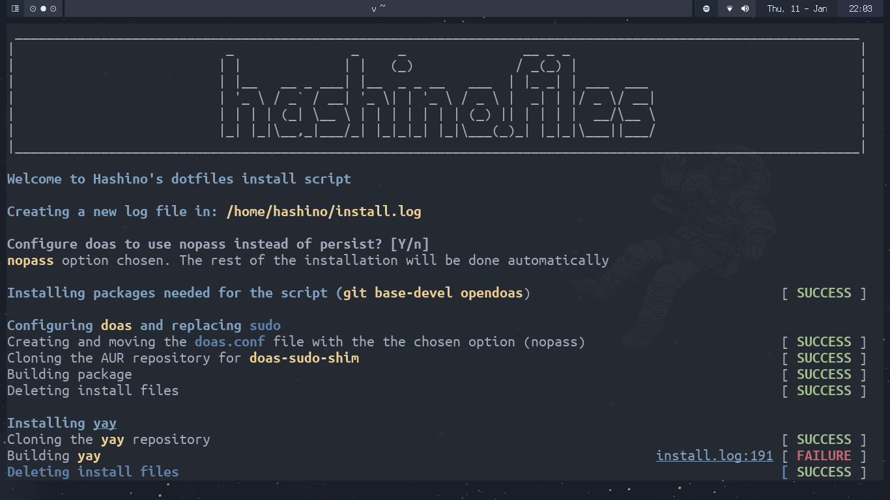
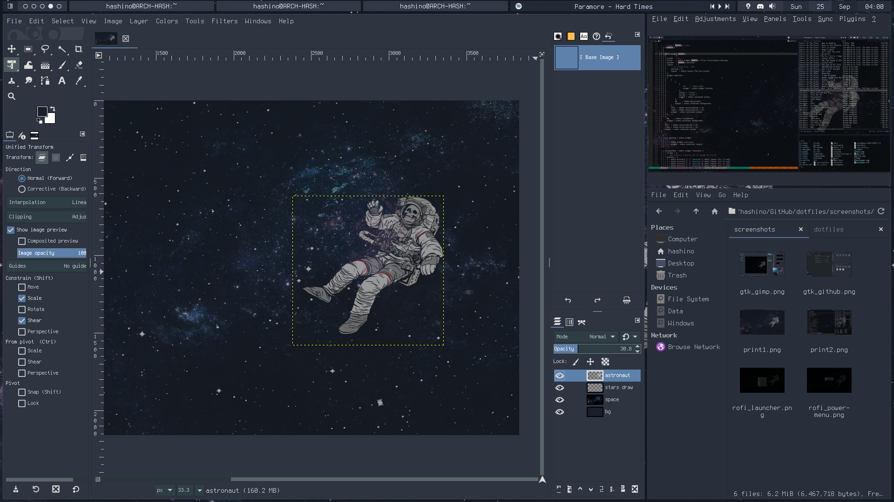
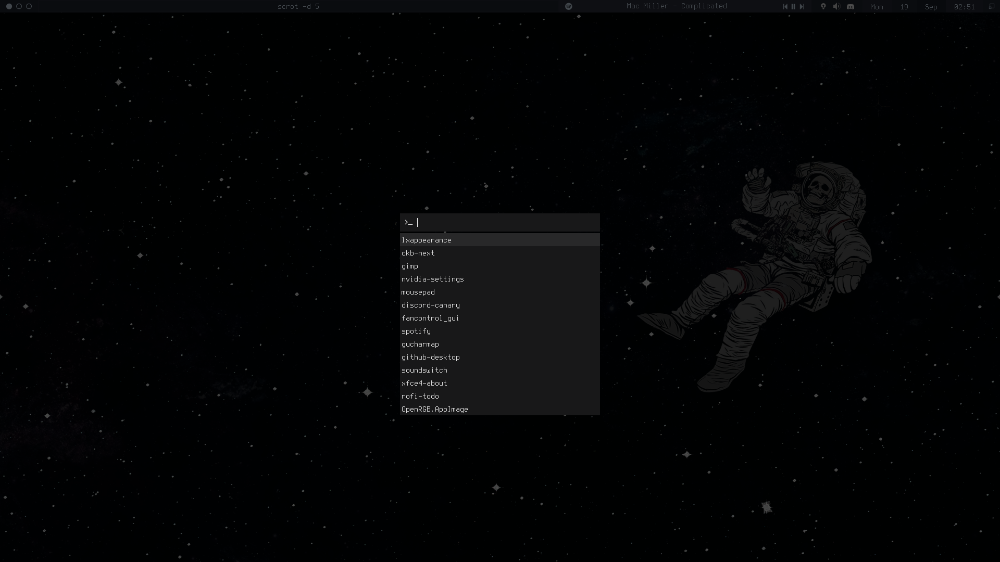
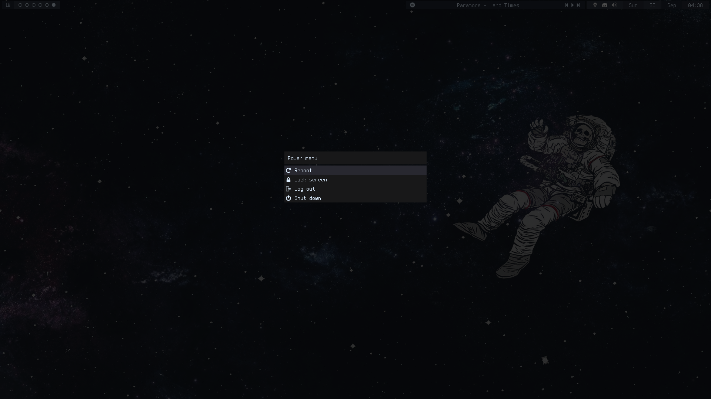

# My personal dotfiles. Based on my personal tweaks of the [Nord Color Scheme](https://www.nordtheme.com/docs/colors-and-palettes)

| Windows Manager       | [AwesomeWM](https://awesomewm.org/) |
| :---:                 | :---:                       |
| Wallpaper             | [wallpaper](.config/awesome/theme/wallpaper.png) |
| GTK Theme             | [Adapta FrostBlue4 Nokto Eta](https://github.com/Adapta-Projects/Adapta-Nord) |
| Icon Theme            | [Papirus Icon Theme](https://github.com/PapirusDevelopmentTeam/papirus-icon-theme) |
| Folder Theme          | [Papirus Nord Polar Night 3](https://github.com/Adapta-Projects/Papirus-Nord) |
| Cursor Theme          | [Custom Built](https://gitlab.com/zoli111/cursor-generator) [Simp1e](https://www.pling.com/p/1405210) |
| System Font           | [Terminus TTF](http://terminus-font.sourceforge.net/) |
| Application Launcher  | [Rofi](https://github.com/davatorium/rofi) |
| Power Menu            | [Rofi Power Menu](https://github.com/jluttine/rofi-power-menu) |
| Compositor            | [Picom](https://github.com/yshui/picom) |
| File Manager          | [Nemo](https://github.com/linuxmint/nemo) |
| Text Editor           | [Neovim](https://github.com/neovim/neovim) with [Neovide](https://github.com/neovide/neovide) |

| Terminal Emulator     | [Terminator](https://archlinux.org/packages/extra/any/terminator/) |
| :---:                 | :---:                         |
| Shell                 | [Fish](https://github.com/fish-shell/fish-shell) |
| Terminal Font         | [Ubuntu Mono](https://design.ubuntu.com/font/) |
| Terminal Colors       | [Nord Color Scheme](https://www.nordtheme.com/ports) |

### All of the applications on the table above are avaible in the AUR/arch repositories
##### Complete list of applications can be found in [.scripts/pkg.list](.scripts/pkg.list)

---
## Install

This install script is meant to be run right after the first boot into the
desktop of a clean arch install with the archinstall script set to `desktop : awesome`

> [!WARNING]
> this install script replaces the `sudo` command with `opendoas` and sets it to
> either *persist** or *nopass* (check opendoas manpage for more info) for the
> wheel usergroup

```bash
wget -q https://raw.githubusercontent.com/Hashino/dotfiles/main/.scripts/install_dotfiles.sh && chmod +x install_dotfiles.sh && ./install_dotfiles.sh && rm -f ~/.bash_history && rm -f .wget-hsts && killall Xorg
```

This install script was validated to work on f584352

## Encrypted files

A few paths in this repo are encrypted with [git-crypt](https://github.com/AGWA/git-crypt)
(personal notes and machine-local secrets — see `.gitattributes`). **Nothing you
need is in there.** Cloning, installing and running everything works with those
files left as unreadable blobs; the install script asks *"Are you Hashino?"* and
skips them on a "no".

File **names** stay visible, only contents are encrypted.

For the owner, on a fresh machine:

```bash
./.scripts/unlock_secrets.sh      # asks for the passphrase
```

The git-crypt key itself is committed sealed with that passphrase
(`.scripts/git-crypt.key.gpg`, GPG symmetric AES-256), which is what makes a
clean reinstall need nothing but the passphrase. To seal it again after
rotating: `./.scripts/seal_secrets.sh`.

# Update

After commit [2baca85](https://github.com/Hashino/dotfiles/commit/2baca85b2871d204b779bf2e5d7e2800e8de7c01), the dotfiles should auto update on login. Restarting
awesome also triggers the auto update process.

> [!INFO]
> If this behaviour is undesidered, either fork the repository or dettach your
> local copy from remote (by deleting `~/.dotfiles/.git`)

## Screenshots









