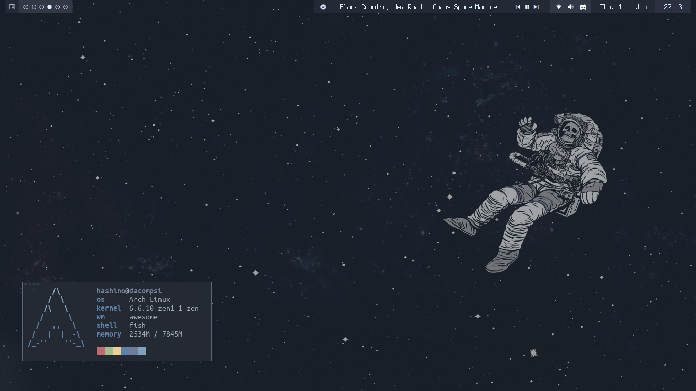

# My personal dotfiles. Based on my personal tweaks of the [Nord Color Scheme](https://www.nordtheme.com/docs/colors-and-palettes)

| Windows Manager       | [AwesomeWM](https://awesomewm.org/) |
| :---:                 | :---:                               |
| Wallpaper             | [.config/awesome/theme/wallpaper.png](.config/awesome/theme/wallpaper.png) |
| GTK Theme             | [Adapta-FrostBlue4-Nokto-Eta](https://github.com/Adapta-Projects/Adapta-Nord) |
| Icon Theme            | [Papirus Icon Theme](https://github.com/PapirusDevelopmentTeam/papirus-icon-theme) |
| Folder Theme          | [Papirus Nord Polar Night 3](https://github.com/Adapta-Projects/Papirus-Nord) |
| Cursor Theme          | [Custom Built](https://gitlab.com/zoli111/cursor-generator) [Simp1e](https://www.pling.com/p/1405210) |
| System Font           | [Terminus (TTF)](http://terminus-font.sourceforge.net/) |
| Application Launcher  | [Rofi](https://github.com/davatorium/rofi) |
| Power Menu            | [Rofi Power Menu](https://github.com/jluttine/rofi-power-menu) |
| Compositor            | [Picom](https://github.com/yshui/picom) |
| File Manager          | [Nemo](https://github.com/linuxmint/nemo) |
| Text Editor           | [Neovim](https://github.com/neovim/neovim) with [Neovide](https://github.com/neovide/neovide) |

| Terminal Emulator     | [Terminator](https://archlinux.org/packages/extra/any/terminator/) |
| :---:                 | :---:                               |
| Shell                 | [Fish](https://github.com/fish-shell/fish-shell) |
| Terminal Font         | [Ubuntu Mono](https://design.ubuntu.com/font/) |
| Terminal Colors       | [Nord Color Scheme](https://www.nordtheme.com/ports) |

### All of the applications on the table above are avaible in the AUR/arch repositories
##### Complete list of applications can be found in [.scripts/pkg.list](.scripts/pkg.list)

---
## Install

This install script is meant to be run right after a clean arch install with the archinstall script set to desktop>awesome
```bash
wget -q https://raw.githubusercontent.com/Hashino/dotfiles/main/.scripts/install_dotfiles.sh && chmod +x install_dotfiles.sh && ./install_dotfiles.sh && rm -f ~/.bash_history && rm -f .wget-hsts && killall Xorg
```

## Screenshots



