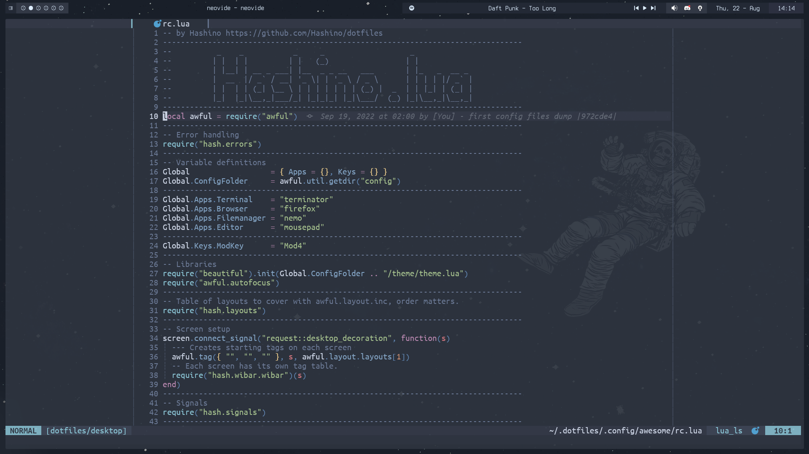

#### My personal dotfiles. Based on my personal tweaks of the [Nord Color Scheme](https://www.nordtheme.com/docs/colors-and-palettes)

| Windows Manager | [AwesomeWM](https://awesomewm.org/) | 
| :---:   | :---: | 
| Compositor | [Picom](https://github.com/yshui/picom) |
| Task Switcher | [Rofi](https://github.com/davatorium/rofi) | 
| Power Menu | [Rofi Power Menu](https://github.com/jluttine/rofi-power-menu) | 
| GTK Theme | [Adapta-FrostBlue4-Nokto-Eta](https://github.com/Adapta-Projects/Adapta-Nord) | 
| Icon Theme | [Papirus Icon Theme](https://github.com/PapirusDevelopmentTeam/papirus-icon-theme) |
| Cursor Theme | [Custom Built](https://gitlab.com/zoli111/cursor-generator) [Simp1e](https://www.pling.com/p/1405210) |
| System Font | [Terminus (TTF)](http://terminus-font.sourceforge.net/) |
| Terminal Font | [Ubuntu Mono](https://design.ubuntu.com/font/) |
| Terminal Colors | [Nord Color Scheme](https://www.nordtheme.com/ports) |

###### All of the applications on the table above are avaible in the AUR

---

## Screenshots

